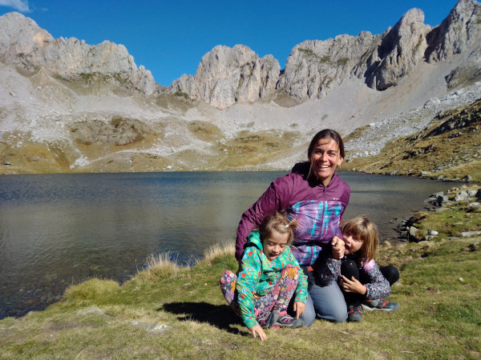

<header class="major">
    <h2>Sobre mi   </h2>
</header>

### Professional
Després d'haver treballat com a programadora ABAP i haver-me perdut en la burocràcia d'una gran empresa de transports, com a gestora i responsable de projectes SAP-Human Capital Management. 

Vaig decidir fer un canvi de rumb professional i passar a treballar desde casa, cocreant el projecte [Zynthian](zynthian.org) amb la meva parella i esdevenint Consultora Tecnològica per petites empreses, apostant per la filosofia del [software lliure](https://ca.wikipedia.org/wiki/Programari_lliure).

En aquesta sentit les solucions que proposo segueixen aquesta filosofia, tant en la utilització de programari existent que estigui distribuït amb aquest tipus de llicència, com amb l'aportació de noves funcionalitats que puguin arribar a ser publicades obertament.

### Personal
Mare de dues nenes i afincada a Reus, m'agrada involucrar-me en l'àmbit educatiu i participar activament en les diferents iniciatives.  Tant es així que vaig ser una de les fundadores del [grup de criança Colors](santscolors.cat) (al barri de Sants de Barcelona), impulsora del [Bicibús a l'Escola Alberich i Casas](https://sites.google.com/view/bicibus-alberich/) i mentora en el [Technovation Girls 2022](https://twitter.com/Escola_Alberich/status/1516814648380698635) entre d'altres.

